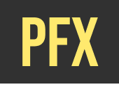

  

 

## ⚡ Introduction

 

_**Preflix** is the second group project I participated in during my training at the Wild Code School._

**Concept:** directory of movies and TV shows provided by the TMDB API, indicating where to watch them. 

**Team:** 4 students in web development (Axel Janiak, Sylvain Lafaye, Adrien Douville, and me).

**Language:** 🇫🇷

 

## 🚀 Achievements 

 

**My completed tasks:** 
- developed a search functionality that compares user input with the data provided by the TMDB API through the fetch function ;
- implemented a genre filter: users can open a menu listing genres and select the one they wish to see displayed, using React Context and several JavaScript array methods ;
- implemented specific filters for movies and TV series ;
- implemented PropTypes ;
- contributed to creating the router (main.jsx) and responsive CSS code. 

**Priority area for improvement:** implementing infinite scroll.

**Note:** This repository contains files from the Wild Code School pedagogical framework Harmonia, however we did not use it for our project as we only worked on the front-end part.

 

## 🔧 Technologies and tools

 

    

  

 

## ⭐ Final overview

 

<a href="https://youtu.be/SAp3s6dXwaM" target="blank">Check out how it looks</a>

_Deployment coming soon!_

 

  

